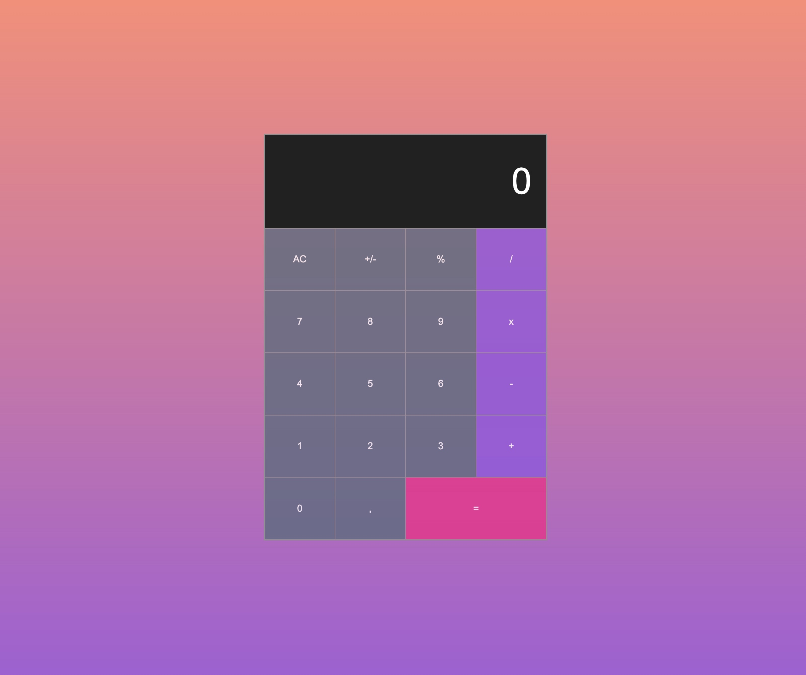

# Calculator

## Subject

A Calculator

## Features

- Buttons for add, substract, divide, multiply, pourcent

- Button to clear

- Button for decimal (2 numbers after comma)

- Button equal

## Tech Stack

**Client:** HTML - CSS - JavaScript

## Link

[Calculator](https://louiscollard.github.io/Calculator/)

## Screenshot

